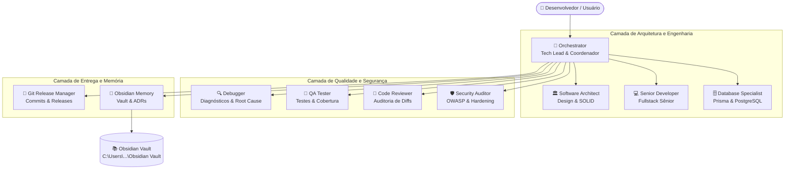

# 🤖 Arquitetura Multiagente do Projeto

Bem-vindo à arquitetura profissional de agentes especializados do projeto **Radar de Oportunidades**.

Este sistema multiagente foi projetado para operar com divisão clara de responsabilidades, alta especialização técnica, colaboração fluida e persistência contínua de conhecimento no **Obsidian Vault**.

---

## 🏛️ Visão Geral da Arquitetura

O sistema é coordenado pelo **Orchestrator** (Tech Lead), que lidera uma equipe de 9 agentes especialistas. Cada agente possui escopo delimitado, responsabilidades inequívocas e padrões rígidos de entrega.



---

## 👥 Catálogo de Agentes Especializados

| # | Agente | Identificador | Papel Principal | Quando Acionar |
| :-: | :--- | :--- | :--- | :--- |
| 1 | **Orchestrator** | `orchestrator` | Tech Lead & Coordenação Geral | Em todas as solicitações iniciais, planejamento e fechamento de demandas. |
| 2 | **Software Architect** | `software-architect` | Design de Software, SOLID & Clean Arch | Decisões de arquitetura, estruturação de módulos e criação de ADRs. |
| 3 | **Senior Developer** | `senior-developer` | Desenvolvimento Fullstack Sênior | Implementação de features, serviços NestJS, componentes Next.js e refatorações. |
| 4 | **Debugger** | `debugger` | Investigação Forense & Causa Raiz | Erros de compilação, crashes de runtime, falhas de API ou bugs complexos. |
| 5 | **Code Reviewer** | `code-reviewer` | Auditoria Estática & Revisão de Código | Revisão de diffs antes de merge ou finalização de tarefas. |
| 6 | **QA Tester** | `qa-tester` | Engenharia de Testes & Qualidade | Execução e elaboração de testes unitários, de integração e validação de regressão. |
| 7 | **Security Auditor** | `security-auditor` | Auditoria de Segurança & OWASP | Análise de rotas sensíveis, autenticação, sanitização e vazamento de dados. |
| 8 | **Database Specialist** | `database-specialist` | Modelagem de Dados & Prisma ORM | Criação e evolução de schemas, migrations de banco, índices e integridade. |
| 9 | **Obsidian Memory** | `obsidian-memory` | Memória Técnica Persistente | Documentação de ADRs, fichas de bugs, DevLogs e aprendizados no Vault. |
| 10 | **Git Release Manager** | `git-release-manager` | Git & Preparação de Releases | Formatação de commits convencionais, changelog e geração de ZIP. |

---

## 🔄 Fluxos de Trabalho Recomendados

### 1. Fluxo para Novas Features
```text
Orchestrator
  → Software Architect (quando há impacto estrutural ou nova API)
  → Senior Developer (implementação com código limpo)
  → QA Tester (validação de testes e casos de borda)
  → Code Reviewer (inspeção técnica do diff)
  → Security Auditor (quando envolve autenticação ou dados sensíveis)
  → Obsidian Memory (documentação no Vault)
  → Orchestrator (entrega consolidada)
```

### 2. Fluxo para Resolução de Bugs
```text
Orchestrator
  → Debugger (investigação: sintoma → evidência → hipótese → causa raiz)
  → Senior Developer (aplicação da correção pontual)
  → QA Tester (teste de regressão e validação do fix)
  → Code Reviewer (revisão do diff da correção)
  → Obsidian Memory (registro na pasta Bugs/ do Obsidian)
  → Orchestrator (relatório final)
```

### 3. Fluxo para Alterações de Banco de Dados
```text
Orchestrator
  → Database Specialist (análise de impacto e risco de perda de dados)
  → Senior Developer (ajuste no schema Prisma e migração)
  → QA Tester (testes de persistência e integridade)
  → Obsidian Memory (registro do novo modelo em Database/)
```

---

## ⚡ Skills Reutilizáveis (`.agents/skills/`)

O projeto dispõe de 8 skills automatizadas prontas para uso:

1. `/analyze-project`: Diagnóstico rápido da integridade do monorepo, dependências e status do Git.
2. `/fix-bug`: Rotina guiada de depuração com causa raiz e registro técnico.
3. `/implement-feature`: Ciclo completo de desenvolvimento de funcionalidades.
4. `/review-code`: Auditoria de qualidade com classificação de severidade (`CRITICAL`, `HIGH`, etc.).
5. `/run-tests`: Execução automatizada de suítes de testes e checagem de tipos.
6. `/document-obsidian`: Arquivamento de ADRs, DevLogs e fichas no Obsidian Vault.
7. `/prepare-release`: Build de produção, atualização de changelog e empacotamento ZIP.
8. `/security-check`: Varredura contra vulnerabilidades (`npm audit`) e checagem de secrets.

---

## 🧠 Integração com o Obsidian Vault

- **Localização do Vault**: `C:\Users\Administrator\Documents\Obsidian Vault`
- **Estrutura no Vault**:
  - `Projects/Radar-de-Oportunidades/Overview.md`
  - `Projects/Radar-de-Oportunidades/Architecture.md`
  - `Projects/Radar-de-Oportunidades/Tasks.md`
  - `Projects/Radar-de-Oportunidades/Changelog.md`
  - `Projects/Radar-de-Oportunidades/Decisions/` (ADR-001, ADR-002...)
  - `Projects/Radar-de-Oportunidades/Bugs/` (BUG-001, BUG-002...)
  - `Projects/Radar-de-Oportunidades/DevLog/` (YYYY-MM-DD.md)
  - `Projects/Radar-de-Oportunidades/Database/`
- **Zero-Leak Policy**: Nenhuma senha, token ou chave privada é gravada no Obsidian; dados sensíveis são substituídos por `[REDACTED]`.

---

## 💡 Como Acessar e Utilizar os Agentes

1. **No Chat do Antigravity**:
   - Utilize comandos de barra (`/`) para invocar as skills instaladas, como `/review-code` ou `/document-obsidian`.
   - Digite `/agents` para listar todos os agentes disponíveis no ambiente e no workspace.
2. **Via Delegação do Orchestrator**:
   - Por padrão, inicie qualquer solicitação normalmente: o **Orchestrator** selecionará autonomamente os agentes especialistas requeridos para executar a tarefa.
