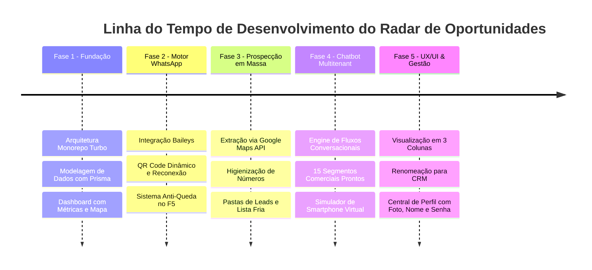

# 🎯 Radar de Oportunidades PRO

> **Plataforma Omnichannel B2B de Prospecção Ativa, CRM Inteligente & Automação de Conversas via WhatsApp com IA**

[](https://nextjs.org/)
[](https://nestjs.com/)
[](https://www.typescriptlang.org/)
[](https://tailwindcss.com/)
[](https://www.prisma.io/)
[](https://radar-de-oportunidades-virid.vercel.app)

---

## 🌐 Demonstração Online & Ambientes

- **Ambiente de Produção (Vercel)**: [https://radar-de-oportunidades-virid.vercel.app](https://radar-de-oportunidades-virid.vercel.app)
- **Painel CRM Comercial**: `/pipeline`
- **Fluxos de Conversação & Modelos**: `/flows`
- **Gestão de Usuários & Meu Perfil**: `/users`

---

## 💡 Visão Geral da Plataforma

O **Radar de Oportunidades PRO** é uma solução completa de engenharia de software voltada para captação comercial B2B de alto volume. O sistema integra prospecção territorial através do Google Maps e OpenStreetMap, verificação em lote de números ativos de WhatsApp, funil de vendas (CRM) visual estilo Kanban, chatbot de atendimento com 15 modelos de segmentos de mercado pré-configurados e simulação virtual em smartphone para testes pré-disparo.

---

## 🚀 Principais Módulos & Capacidades

```
┌────────────────────────────────────────────────────────────────────────┐
│                        RADAR DE OPORTUNIDADES                          │
└──────┬────────────────────┬────────────────────┬────────────────────┬──┘
       │                    │                    │                    │
       ▼                    ▼                    ▼                    ▼
 🗺️ PROSPECÇÃO        🤖 DISPARADOR        💬 ATENDIMENTO       📊 CRM FUNIL
 ├ Google Places      ├ Baileys Engine     ├ 15 Nichos B2B      ├ Kanban 7 Etapas
 ├ Extração Telefones ├ Spintax Anti-Ban   ├ Celular Virtual    ├ Ticket Médio
 ├ Filtro Sem Whats   ├ Delays Aleatórios  ├ Regras de FAQ      ├ Drag & Drop
 └ Lista Fria Leads   └ Transbordo Humano  └ Variáveis Dinâmicas└ Gestão Contratos
```

### 1. 🗺️ Prospecção Territorial & Inteligência de Leads
- **Importação Direta do Google Maps & OpenStreetMap**: busca por nicho e cidade/bairro com extração automática de razão social, telefones, endereços e avaliação de clientes.
- **Mapeador Inteligente de WhatsApp**: algoritmo que higieniza números e separa automaticamente telefones fixos daqueles com WhatsApp ativo.
- **Sistema de Pastas Dinâmicas & Lista Fria**: isolamento automático de leads sem resposta para reaquecimento programado.

### 2. 🤖 Automação & Robô de WhatsApp (Baileys Engine)
- **Sessão Persistente**: conexão via QR Code de alta disponibilidade que não desconecta ao recarregar a página ou navegar pela plataforma.
- **Spintax Nativo Anti-Bloqueio**: variação automática de mensagens (`{Olá|Oi|Tudo bem?}`) para proteger os chips contra banimentos.
- **Delays Humanos & Digitação Realista**: intervalos aleatórios entre mensagens simulando digitação humana.
- **Transbordo Imediato para Humano**: o robô pausa o atendimento autônomo assim que um operador assume a conversa ou o cliente demonstra alto interesse comercial.

### 3. 💬 Fluxos de Conversa & Chatbot para Múltiplas Empresas (`/flows`)
- **Organização em Colunas no Padrão do Sistema**: grade limpa e responsiva de 3 colunas exibindo os 15 modelos de segmentos comerciais lado a lado.
- **15 Modelos Comerciais Prontos**:
  1. 🩺 Clínica & Consultório Médico / Odontológico
  2. 🐾 Pet Shop & Clínica Veterinária
  3. 💻 Empresa de TI, Sites & Sistemas
  4. 🏢 Imobiliária & Corretores de Imóveis
  5. 🍕 Restaurante, Pizzaria & Delivery
  6. ⚖️ Escritório de Advocacia & Assessoria Jurídica
  7. 📊 Contabilidade, Fiscal & Abertura de Empresas
  8. 🚗 Oficina Mecânica & Auto Center
  9. 💅 Salão de Beleza, Estética & Barbearia
  10. 🛍️ Loja de Roupas, Calçados & Moda
  11. 🏋️‍♂️ Academia, Crossfit & Studio Fitness
  12. ☀️ Energia Solar & Engenharia Elétrica
  13. 🎓 Cursos, Idiomas & Treinamentos
  14. 🛡️ Segurança Eletrônica, CFTV & Alarmes
  15. 🧹 Limpeza, Dedetização & Serviços Prediais
- **Simulador de WhatsApp em Celular Virtual**: smartphone interativo embutido na tela para testar perguntas, respostas e alternativas antes de iniciar disparos reais.
- **Regras de Resposta Rápida (FAQ)**: respostas automáticas para dúvidas frequentes de preço, endereço, formas de pagamento e horários.

### 4. 📊 CRM Comercial Funil de Vendas (`/pipeline`)
- **Quadro Kanban com 7 Etapas**: Novo Lead, Qualificado, Contato Realizado, Visita Agendada, Proposta Enviada, Negociação e Contrato Fechado.
- **Métricas em Tempo Real**: Total de Oportunidades no CRM, Valor Estimado da Carteira e Ticket Médio.
- **Ações Rápidas**: criação e avanço de oportunidades com drag-and-drop e modal completo de histórico.

### 5. 👤 Central de Usuários & Meu Perfil (`/users`)
- **Foto de Perfil com Upload & Preview**: envie fotos no formato PNG, JPG ou WebP de até 5MB. A imagem substitui o avatar em toda a plataforma.
- **Troca de Nome & Cargo**: altere sua identificação a qualquer momento com sincronização instantânea.
- **Segurança & Troca de Senha**: redefinição de senha com verificação de segurança, validação de caracteres e botão de visualização rápida.
- **Acesso com 1 Clique**: clique diretamente no card do usuário no rodapé da barra lateral ou na tela de Usuários.

---

## 📈 Linha do Tempo da Experiência & Evolução Técnica



### 🗓️ Marco 1: Arquitetura & Base de Dados
- Configuração do monorepo Turborepo com `@radar/types`, NestJS API e Next.js 14 App Router.
- Modelagem de entidades no Prisma (Leads, Contatos, Endereços, Funil CRM, Usuários e Permissões RBAC).
- Painel de métricas analíticas e geolocalização de oportunidades.

### 🗓️ Marco 2: Engenharia de Conexão WhatsApp (Baileys)
- Eliminação de dependência de APIs pagas de terceiros através da implementação direta da biblioteca Baileys.
- Implementação de persistência da sessão em disco (`auth_info_baileys`) com rotação de chaves.
- Resolução do problema de despareamento involuntário em recarregamentos (F5) e tratamento de reconexão automática resiliente.

### 🗓️ Marco 3: Mapeamento de Clientes & Proteção de Disparos
- Criação do buscador territorial integrado ao Google Places e fontes abertas.
- Sistema de verificação de telefones que isola números fixos ou sem WhatsApp da fila de disparo.
- Painel de segurança com controle de cadência de envio, limite de mensagens diárias e atrasos randômicos.

### 🗓️ Marco 4: Chatbot Multitenant & 15 Segmentos Prontos
- Criação da máquina de estados para fluxos de atendimento (`bot-flow.service.ts`).
- Desenvolvimento de 15 árvores de conversação cobrindo os maiores nichos empresariais do mercado brasileiro.
- Criação de um smartphone virtual na interface para homologação prévia das etapas do robô sem custo de envio.

### 🗓️ Marco 5: Experiência Visual, CRM & Gestão de Contas
- Ajuste do layout de modelos em 3 colunas limpas, eliminando barras de rolagem horizontais.
- Unificação e renomeação do antigo pipeline comercial para CRM de Vendas.
- Implementação de upload de foto de perfil em Base64, personalização de nome e redefinição de senha com persistência em armazenamento seguro.

---

## 🛠️ Stack Tecnológica

| Camada | Tecnologias Utilizadas |
|---|---|
| **Frontend** | Next.js 14 (App Router), React 18, Tailwind CSS, Lucide Icons, Zustand, React Hot Toast |
| **Backend** | NestJS 10, TypeScript, RxJS, Swagger / OpenAPI |
| **Mensageria** | @whiskeysockets/baileys, Spintax Parser, WebSocket / Polling |
| **Banco de Dados** | Prisma ORM, SQLite (local) / PostgreSQL (cloud) |
| **Geolocalização** | Google Places API, Leaflet, OpenStreetMap |
| **Monorepo & Build** | Turborepo, NPM Workspaces |
| **Hospedagem & CI/CD** | Vercel (Web Serverless), Node.js Runtime (Local API) |

---

## 🔒 Segurança & Boas Práticas

- **Proteção de Credenciais**: As senhas de acesso utilizam criptografia irreversível via `bcrypt` com salt rounds elevados.
- **Isolamento de Sessões Baileys**: As chaves criptográficas da sessão do WhatsApp são mantidas exclusivamente no dispositivo local e protegidas pelo `.gitignore`.
- **Zero Vazamento de Segredos**: Arquivos de ambiente e logs operacionais são desconsiderados do controle de versão.

---

## 💻 Como Rodar o Projeto Localmente

### Pré-requisitos
- [Node.js](https://nodejs.org/) versão 20 ou superior
- Gerenciador de pacotes `npm`

### 1. Clonar o Repositório
```bash
git clone https://github.com/WevcastDEV/radar.git
cd radar
```

### 2. Instalar Dependências
```bash
npm install
```

### 3. Configurar Variáveis de Ambiente
```bash
cp .env.example .env
```

### 4. Iniciar a Plataforma
No Windows, execute o inicializador automatizado:
```cmd
INICIAR.bat
```
Ou manualmente via terminal:
```bash
# Terminal 1 - Backend API (porta 3001)
cd apps/api
npm run start

# Terminal 2 - Frontend Next.js (porta 3000)
cd apps/web
npm run dev
```

Acesse no seu navegador: [http://localhost:3000](http://localhost:3000)

---

## 👨‍💻 Autor & Manutenção

Desenvolvido e mantido por **Weverton (WCTECH)**  
- GitHub: [@WevcastDEV](https://github.com/WevcastDEV)
- Plataforma: [Radar de Oportunidades PRO](https://radar-de-oportunidades-virid.vercel.app)
